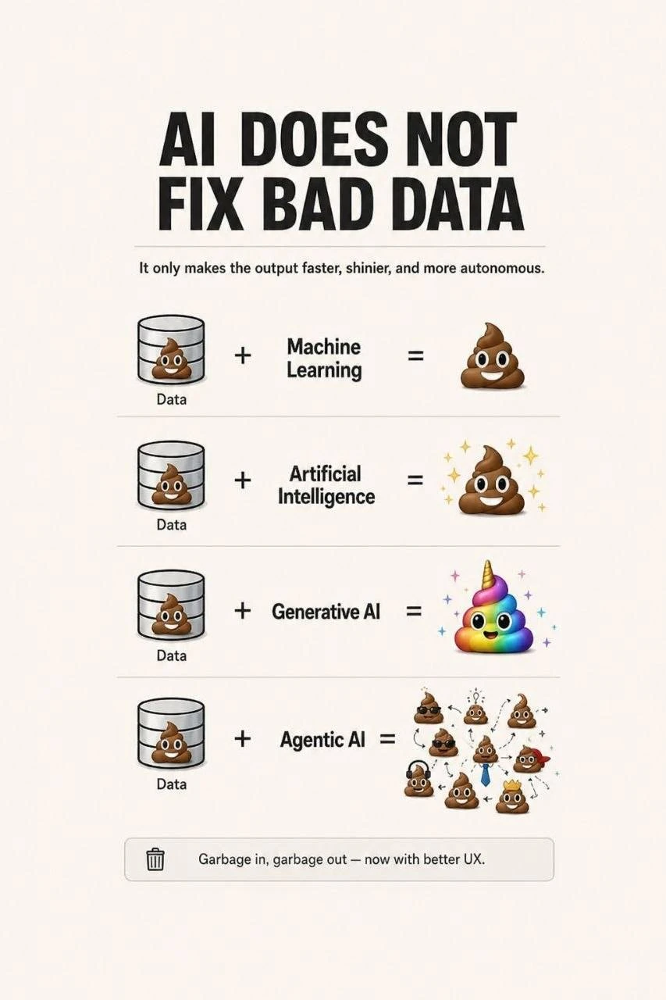

# How to improve AI agents with context, metadata and more

How to provide AI agents with actual Infrastructure information to help manage software development, decrease AI hallucination and generate code compliant to company standards or regulatory requirements

"Garbage in, Garbage out" - decades old statistics/data science motto.

Just like in data analysis AI requires high quality inputs to generate high quality context-specific results relevant to actual environments instead of generic AI slop.

Tools like Confluence Rovo or GitHub Copilot (or other AI LLM chat tools) are becoming quite advanced in performing everyday software development tasks quickly and save time of Devs, QA, DevOps, managers but often return generic, superficial or hallucinatory replies.
To address these issue and make their work context-specific, reliable and predictable there is need to:
1) **provide them with read-only access** to infrastructure, APIs, repositories, telemetry systems, and documentation in order to gather accurate context. In some controlled cases, **agents may also be allowed to perform scoped actions** in non-production environments.
2) **make sure results of their work are compliant** with company requirements/standards and compliance standards (like SOX, PCI DSS or HIPAA)
3) **reduce hallucinations** - like inserting non-existent terraform commands or resource definition - with constrain outputs using validation, schemas, policy checks, and tool-based execution
4) **more sequential - i.e.** support more reliable multi-step workflows where outputs from previous steps are preserved, validated, and reused consistently instead of losing context between interactions.

Industry-standard ways exist to allow this:
- **customized prompts** (e.g. copilot settings, skills in .github/prompts/[copilot-instructions.md]()

- Agent **skills**
- **custom instructions** in .vscode/

- [**MCP**](https://modelcontextprotocol.io/docs/getting-started/intro) **servers** that provides standard interface for agents to get access credentials (scoped) and/or instruction, prompts, guardrails that reduce hallucination, mixing of versions etc (like list of supported terraform cloud resources or their attributes in specific terraform provider version)

**Example**
User needs real world bases estimate of how much will company pay next year for EKS and ECS clusters in us-east region for ‘project x’ if usage keeps growing 10% every month to approve infrastructure budget for the next year

Interfaces that might be needed (assume MCP servers are implemented by 3p vendors or internal developer platform)

**GitHub Copilot Agent**
 |
 +--> **AWS APIs** / CUR / Cost Explorer -cost of or just list of all resources tagged ‘project x’
 +--> **Kubernetes EKS/ECS metrics** - list of cluster resources in namespaces ‘project x’ and their break down per environment
 +--> **Datadog metrics & dashboards** (number of average requests/load/instances running metrics per month)
 +--> **Backstage catalog & metadata** (list of workloads/components/microservices linked to ‘project x', list of AWS accounts used by it, list of Environments)
 +--> **Confluence docs** / runbooks (standarts, requirements, documentation, TechDocs, .md)
 +--> **Terraform repos** / **IaC** (cluster config, container image size, mem/cpu requirements, scaling config)

Here comes chicken and egg issue. To make sure results are compliant with something - that ‘something’ has to exist and be available to agent.
E.g.
- If we want code to be compliant with **company standard** - these has to be **defined and included** in agent prompts or at least be accessible **first**
- If we would like to IaaC generate be compliant with **PCI DSS, HIPPA** etc, this has to be explicitly mentioned in prompts, and specific rules/regulation/control/ version indicated in prompts, skills.
- If we expect agent to lookup AWS resource by 'tags’. All resources in AWS have to be **tagged first.**
- If we want agent to access specific API - MCP server have to be exposed first and access scope defined in those systems **first.**

So for efficient use of above approach there is need for the following pre-requisites:
 - **Company Standards defined**, available, version controlled (and fixed when issue is identified, or tooling evolves)
- All **Cloud Resources Tagged**
- **Software catalog/Internal developer platform exists and exposed via API**
- Custom internal or 3pv APIs exposed and **have MCP servers** (e.g. if ‘system X' does not expose API, agent can’t talk to 'system x’ and therefore efficiently use its capabilities or data). Organizations may need to provide MCP wrappers, CLI integrations, or custom service layers.

**Conclusion**
So in essence such effort has to be coordinated centrally, supported by management and there should be team dedicated to implementing those prerequisites, define standards, develop prompts, skills, setup and maintain MCP servers, software catalogs, compliance requirement, documentation etc.

Enterprise AI effectiveness depends far more on organizational context quality, governance, APIs, standards, metadata, and platform maturity than on the raw LLM itself.

PS:
Also there are potential problems of degradation of documentation quality and feedback loops caused by unreviewed AI-generated content being reused as authoritative source material.

- feedback loops
- degraded documentation quality
- AI-generated misinformation propagation
- recursive AI slop contamination
- prompt injection
- data poisoning
- retrieval poisoning
- RAG poisoning
- indirect prompt injection

Related
- [Backstage MCP server](https://www.linkedin.com/posts/niallthomson_backstage-amazonq-activity-7341130769609670656-3OQX)
- [AWS labs MCP server](https://aws.amazon.com/blogs/aws/the-aws-mcp-server-is-now-generally-available/)
- ​[Using the GitHub MCP Server in your IDE - GitHub Docs](https://docs.github.com/en/copilot/how-tos/provide-context/use-mcp-in-your-ide/use-the-github-mcp-server)
- ​[Datadog MCP Server](https://docs.datadoghq.com/bits_ai/mcp_server/)
- ​[Getting started with the Atlassian Rovo MCP Server | Atlassian Rovo MCP Server Cloud | Atlassian Support](https://support.atlassian.com/atlassian-rovo-mcp-server/docs/getting-started-with-the-atlassian-remote-mcp-server/)
