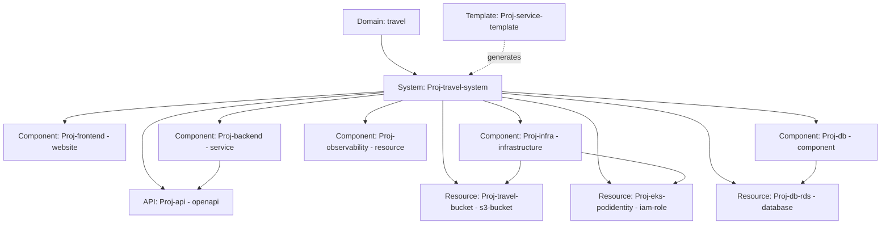

Backstage Software Catalog hierarchy

```mermaid 
flowchart TD

    D1[Domain: travel]

    S1[System: Proj-travel-system]

    C1[Component: Proj-frontend - website]
    C2[Component: Proj-backend - service]
    C3[Component: Proj-infra - infrastructure]
    C4[Component: Proj-observability - resource]
    C5[Component: Proj-db - component]

    R1[Resource: Proj-db-rds - database]
    R2[Resource: Proj-travel-bucket - s3-bucket]
    R3[Resource: Proj-eks-podidentity - iam-role]

    A1[API: Proj-api - openapi]

    T1[Template: Proj-service-template]

    D1 --> S1

    S1 --> C1
    S1 --> C2
    S1 --> C3
    S1 --> C4
    S1 --> C5

    S1 --> R1
    S1 --> R2
    S1 --> R3

    S1 --> A1

    C2 --> A1
    C5 --> R1
    C3 --> R2
    C3 --> R3

    T1 -. generates .-> S1
```
