Benefits of Internal Developers Portal Backstage for Technical Teams

# What is Backstage?

Backstage is a Platform Portal **framework** from Spotify that can provide starting point for new Software Development project in an Organization, as well as become single pane of glass for various Systems, Projects, Components, Services, APIs, and Infrastructure that are being developed and used by the Organization. Initially envisioned to increase visibility of ownership/security posture/maturity and accountability/DevEx in software development companies, with rapid growth of AI agentic workflows became important source of 'context' metadata that could be used not only by Software Development teams but by SRE/Operations, Management as well.

# What is the Backstage Value Proposition?

TL:DR Top things Developer/Team Lead can see in Backstage
Software Catalog gives single pane of glass and ‘entry point’ to:
- Application GitHub repo/Confluence/Jira URL links
- GitHub Actions runs/Deployments
- Application/API dependencies with hyperlinks
- Jira Dashboard 
- SonarQube code quality stats
- DataDog observability dashboards and graphs
- Code vulnerability and security insights (GHAS)
- Public Cloud Cost Insights (FinOps)
- Dora Metrics (SRE)
- Searchable documentation and metadata source (Software catalog/TechDocs)
- Self-service automation for Day 1 operations (Scaffoldings)
more detailed description of each is below.

# Default Backstage components

## **Software Catalog**

Integrated with DVCS (distributed version control system)--GitHub in our case--that displays service metadata and provides links to documentation, infrastructure, CI/CD Pipelines, Observability Dashboards, SAST statistics, and more.

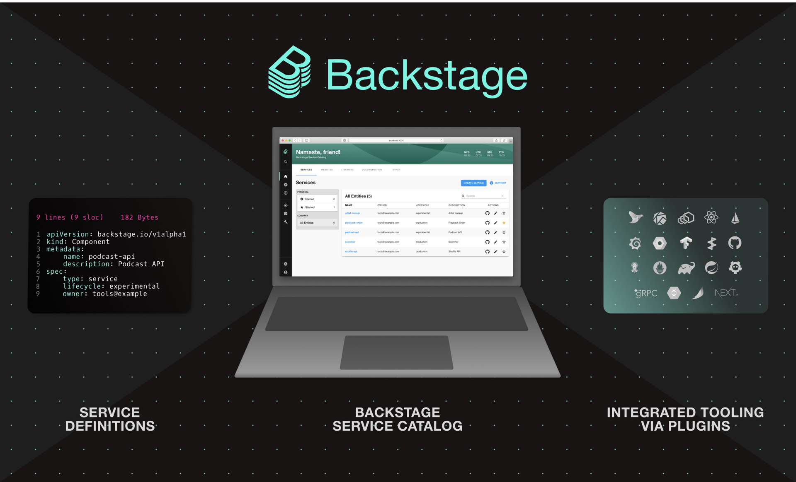

Service catalog entries include the Owner, Lifecycle, and Description on the main screen. By clicking a service name, users can open a dedicated service page that shows the full metadata, URLs/links, and all relevant component plugins in separate tabs (e.g., SonarQube, GitHub, Datadog, AWS, cost, DORA metrics scorecards, etc.). These integrations must be installed, added, and configured as plugins in the Backstage backend and frontend by the platform services team.

In this model, a service acts as an “anchor” entry that enables different pieces of service-related data—typically fetched via API calls—to be aggregated and displayed as a single pane of glass.

Software catalog’s screen with list of services:

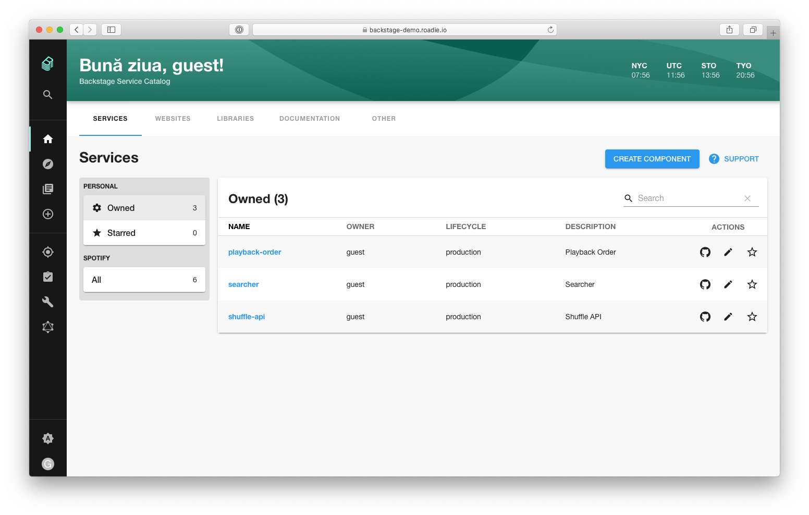

Software catalog entry ‘playlist-proxy’ with its Plugins tabs:

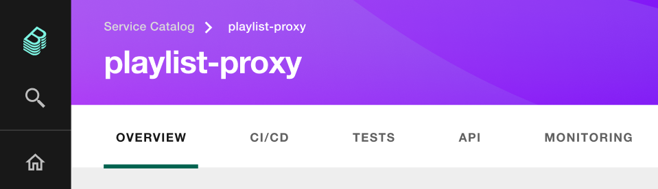

Below is example of Software catalog **overview** page with context-specific plugins (aka Overview Entities) displaying data on ‘Backstage’ catalog entry:
-Built-in About section
- Security & compliance custom section
- SonarQube code quality plugin
- DataDog Graph plugin
- Security Insights from GHAS
- Built-inLinks sections

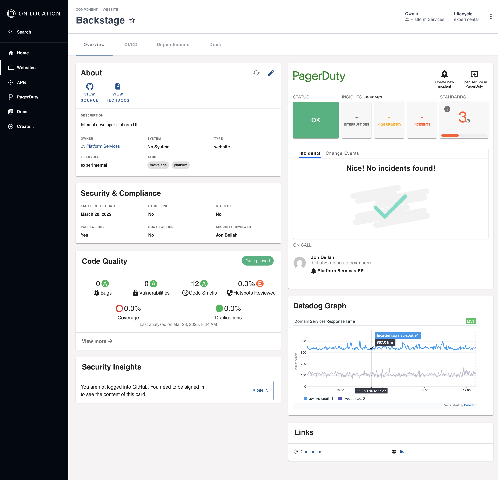

## Software Templates/**Scaffolder aka Developer’s Self Service**

Developer’s Self Service scripts with pre-defined by platform team Software templates that allows quick creation of repos, CI/CD Pipelines, infra, application/service code foundations for the most-often used tech stacks and speeds-up new project initiation for selected [Golden Path](<Golden Path.md>)

## **TechDocs**

Documentation as a Code in markdown format stored along with source code in git repository and displayed as Web-portal.

## Optional Components - Plugins

Plugins allow extending Backstage functionality by calling external API and displaying Information like Infrastructure Costs, Code Quality stats, k8s cluster status, List of Incidents, Service Security Posture, etc

# Useful plugins proposed for investigation

## **Area: CI/CD**

### GitHub Actions plugin

​[https://github.com/backstage/community-plugins/tree/main/workspaces/github-actions/plugins/github-actions](https://github.com/backstage/community-plugins/tree/main/workspaces/github-actions/plugins/github-actions)

Shows latest CI/CD Pipeline GH Actions runs and their status and allows re-run failed workflows, view logs or directly go to specific workflow on GitHub

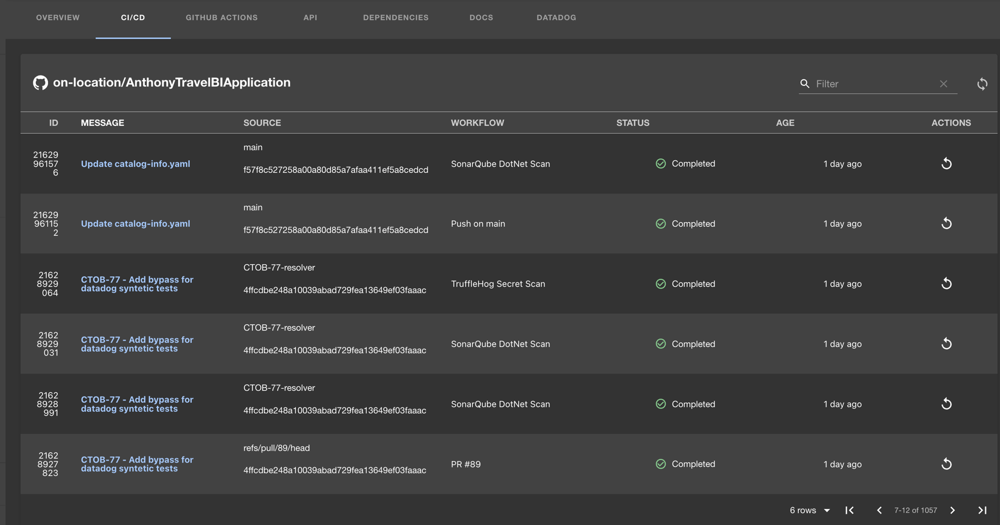

Alternatively available in ‘Cards’ mode with branch selection option:

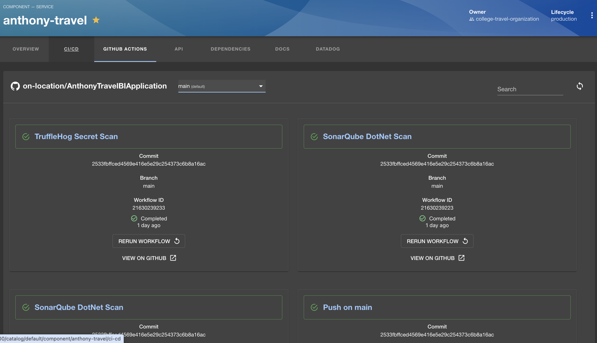

### GitHub Deployments Plugin

[https://www.npmjs.com/package/@backstage-community/plugin-github-deployments](https://www.npmjs.com/package/@backstage-community/plugin-github-deployments)
Plugin provides list of GH Deployments statuses with Environments/Update date and links to relevant Commits

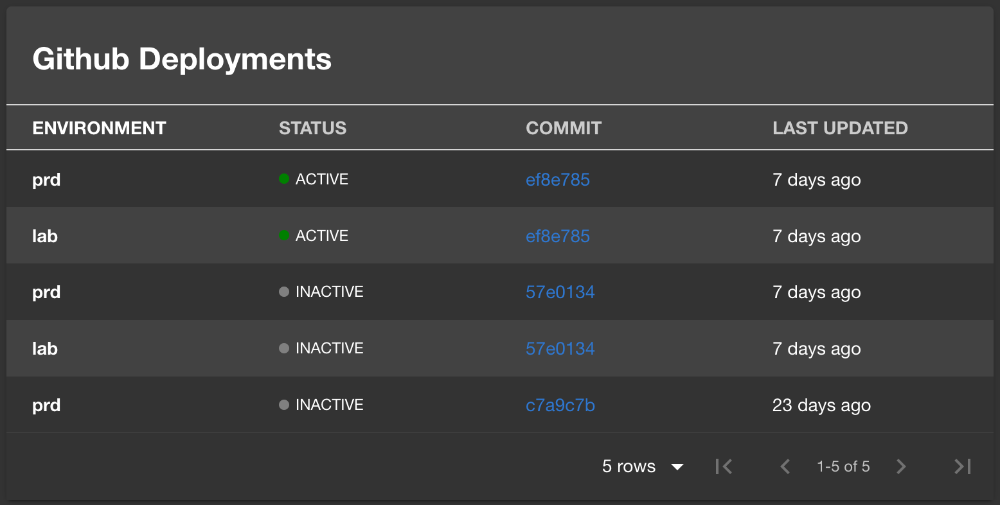

## **Area: Observability**

### DataDog dashboard plugin by Roadie

This plugin embeds one or more DD graphs into the Component’s **Service Catalog Overview** tab as shown below

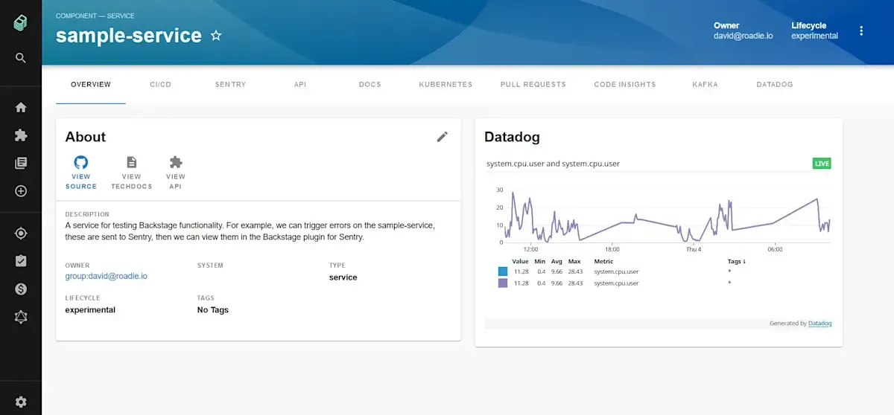

as well as adding its own **DataDog tab** with one or more DD dashboards that give more detailed look into services' metrics/graphs:

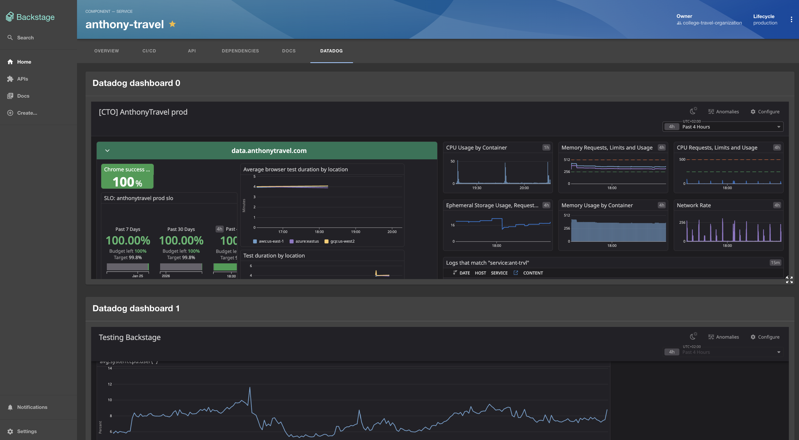

### [DataDog Software Catalog Entity Sync (gh](https://github.com/DataDog/datadog-backstage-plugins)

this Plugin from DataDog allows sync between catalog-info.yaml metadata and DataDog ‘Services’ database, enriching it with more Dependency links.

## Area: Security

### SonarQube Code Quality plugin

[The plugin shows Results of last SonarQube scan](https://github.com/backstage/community-plugins/blob/main/workspaces/sonarqube/plugins/sonarqube-backend/README.md) on Overview page and lets user by clicking on link button (Gate passed on the screenshot below) open Project’s page in SonarQube WebUI and work (ack, review etc) on identified issues: Bugs, Vulnerabilities, CodeSmells, Security Hotspots.

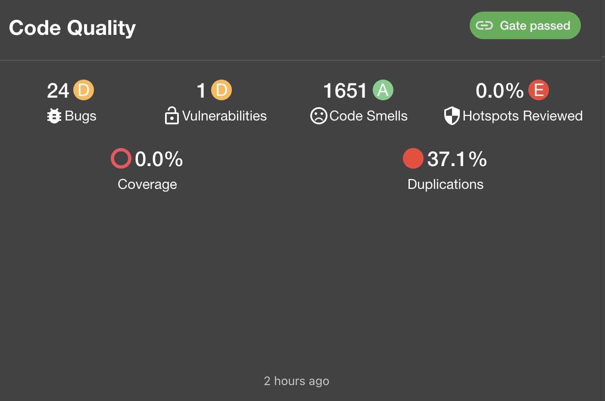

### GitHub Security Insights (GHAS, Dependabot) plugin by Roadie
[https://roadie.io/backstage/plugins/security-insights/](https://roadie.io/backstage/plugins/security-insights/)

Provides list of security issues/incidents raised by GHAS/Dependabot for the current repo (software catalog entity)

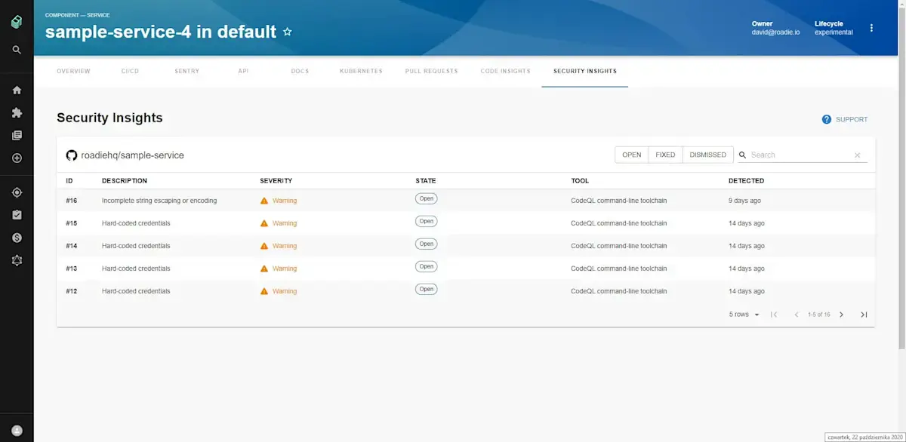

## Area: FinOps

### Infracost FinOps plugin

This plugin uses Cost estimates based on terraform code. Infracost license and CI/CD integration is required.

### Spotify CostInsight plugin with AWS CostExplorer API (needs development)

[https://github.com/backstage/community-plugins/tree/main/workspaces/cost-insights/plugins/cost-insights](https://github.com/backstage/community-plugins/tree/main/workspaces/cost-insights/plugins/cost-insights)

[https://github.com/backstage/community-plugins/blob/main/workspaces/cost-insights/plugins/cost-insights/contrib/aws-cost-explorer-api.md](https://github.com/backstage/community-plugins/blob/main/workspaces/cost-insights/plugins/cost-insights/contrib/aws-cost-explorer-api.md)

### AWSLabs Cost Plugin (beta)

​[https://github.com/awslabs/backstage-plugins-for-aws/tree/main/plugins/cost-insights](https://github.com/awslabs/backstage-plugins-for-aws/tree/main/plugins/cost-insights)

Implements Spotify CostInsightsAPI for AWS. Uses EngineeringCost app-config.yaml configuration entry and Cost Insights tags annotations to filter AWS costs belonging to specific Component using AWS CostExplorer API (catalog-info.yaml):

9

1

2

annotations:

aws.amazon.com/cost-insights-tags

​

e.g. for all production env resoures of component myapp:
aws.amazon.com/cost-insights-tags: component=myapp,environment=prod

or for Kind:Group (Team who is owner of certain resources or Vertical in our case)
aws.amazon.com/cost-insights-tags: owner=TeamName

aws.amazon.com/cost-insights-cost-categories annotation can also be used to map an entity to [AWS cost categories](https://docs.aws.amazon.com/awsaccountbilling/latest/aboutv2/manage-cost-categories.html):
aws.amazon.com/cost-insights-cost-categories: myapp-category=myapp

This plugin’s actions could be exposed to [**MCP Actions Backstage Plugin**](https://github.com/backstage/backstage/tree/master/plugins/mcp-actions-backend) and be used by AI coding tools like Cursor/Claude etc.

### Infrawallet OSS Plugin by Electrolux

Firefly FinOps plugin

# Other plugins

Plugins usually focus on three areas: visualization, automation or scorecards but in general they allow to bring external API into Developer’s Portal single pane of glass and tie data provided by those external API/services to Software Catalog Items - like Systems, Services, APIs, Components.

## Area: Infrastructure Orchestration

### Humanitec Orchestrator plugins

Humanitec has at least two plugins -
One that shows Environments/Application Deployment status similar to ArgoCD status

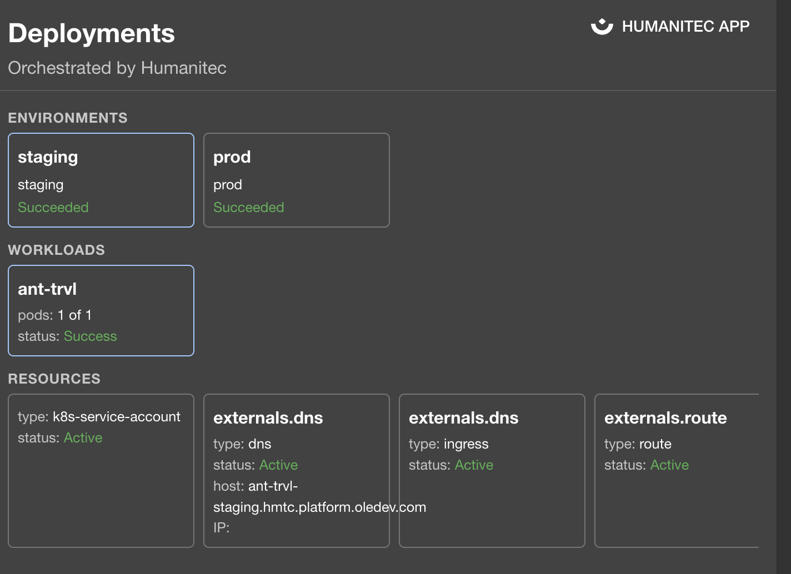

[and other (purely Backend) that helps create Applications/Environments](https://github.com/humanitec/humanitec-backstage-plugins/tree/main/plugins/humanitec-backend-scaffolder-module)in k8s cluster from Backstage ‘Create from Template’ Interface aka Scaffolder module.

### Spacelift Terraform orchestrator Plugin

IaC Orchestrator with Enterprise level features, Terraform stacks, Management, Governance, Policies.

### Env0 IaC orchestrator Plugin

​[GitHub - env0/env0-backstage-plugin: env0 plugin for Backstage](http://github.com/env0/env0-backstage-plugin)

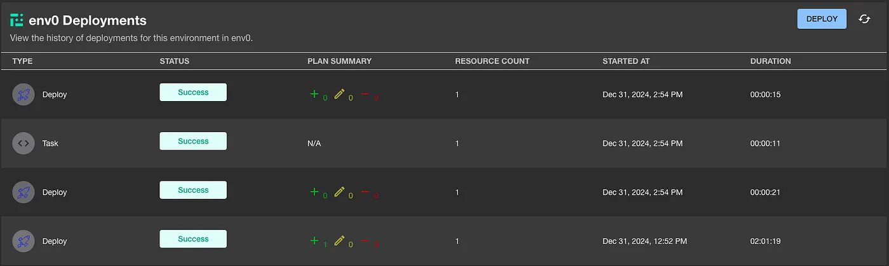

**env0 Scaffolder Backend Module** - Defines two custom actions:

- env0:environment:create: Create a new env0 environment.
- env0:environment:redeploy: Redeploy an existing env0 environment.

**env0 Plugin** - Provides the UI components to:

1. Create and redeploy env0 environments
2. View deployment history
3. Monitor the current status of environments
IaaC Self-Service, Terraform Orchestrator.
​[Mastering Managed IaC Self-Service: The Complete Guide | env zero](https://www.env0.com/blog/mastering-managed-iac-self-service-the-complete-guide)

### Harness Plugins

offers 8 different plugins for Backstage.
​[harness/backstage-plugins](https://github.com/harness/backstage-plugins)

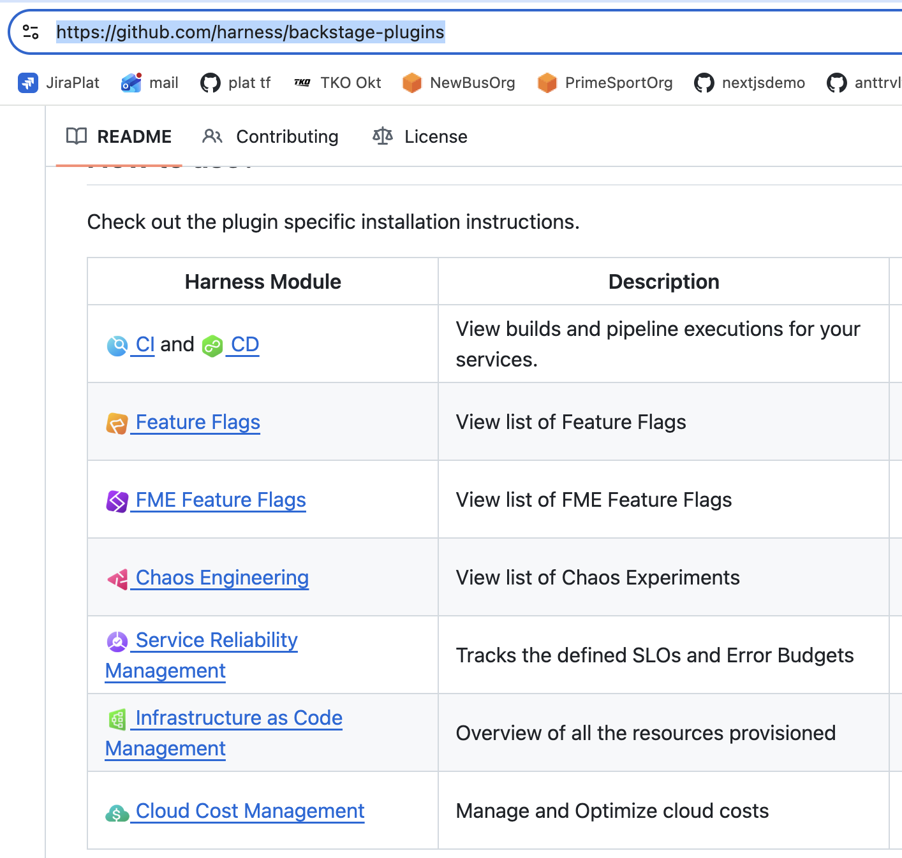

## Area: DevOps Velocity/Reliability

### liatrio backstage dora plugin

​[backstage-dora-plugin: main](https://github.com/liatrio/backstage-dora-plugin/tree/main)

### OpenDORA plugin

Requires Apache DevLake running and collecting GitHub events)
​[https://github.com/DevoteamNL/opendora/tree/main/backstage-plugin/plugins/open-dora#readme](https://github.com/DevoteamNL/opendora/tree/main/backstage-plugin/plugins/open-dora#readme)

## Jira Plugins

### Jira dashboard plugin (Spotify)

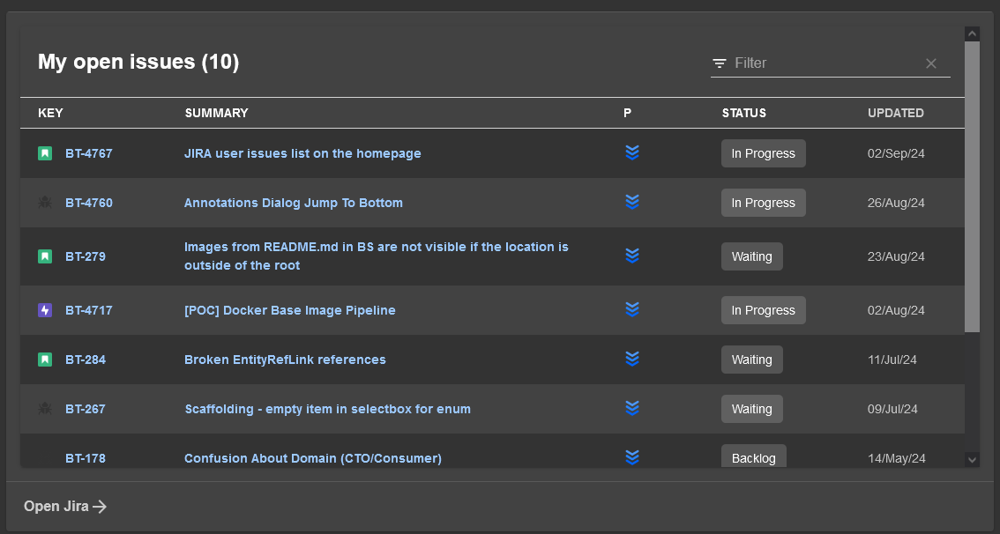

### [Jira plugin by Roadie](https://roadie.io/backstage/plugins/jira/?utm_source=backstage.io&utm_medium=marketplace&utm_campaign=jira)

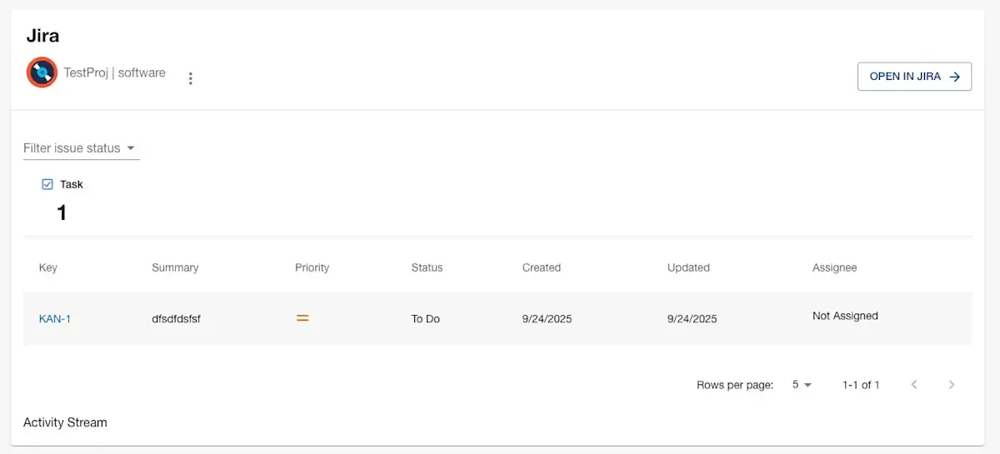

## Scorecards Plugins

### OpsLevel Service Maturity plugin

[https://github.com/OpsLevel/backstage-plugin](https://github.com/OpsLevel/backstage-plugin)

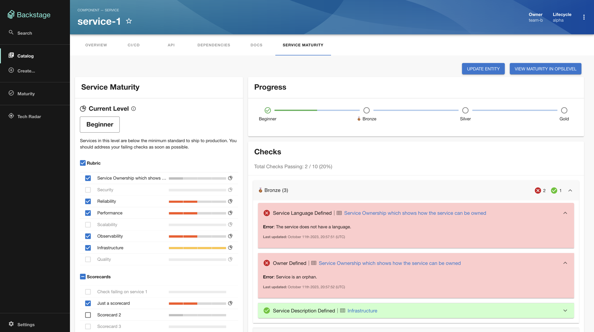

### Oriflame Maturity ScoreCard plugin

​[https://github.com/Oriflame/backstage-plugins/tree/main/plugins/score-card](https://github.com/Oriflame/backstage-plugins/tree/main/plugins/score-card)

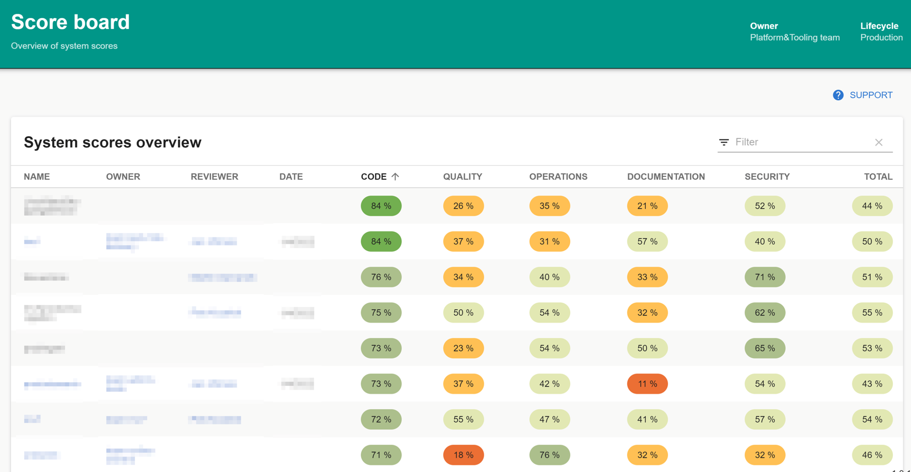

### OpenSSF Scorecard (code quality) - wip

[https://github.com/ossf/scorecard](https://github.com/ossf/scorecard)

## Area: Constant Improvement

### Software catalog Feedback plugin

Plugin that allows provide feedback to Developers of software catalog entry. Good for Internal products fast feedback loop.
​[https://github.com/backstage/community-plugins/tree/main/workspaces/feedback/plugins/feedback](https://github.com/backstage/community-plugins/tree/main/workspaces/feedback/plugins/feedback)

### Backstage DevTools Plugin

Collects information of current dependencies and their versions

[https://github.com/backstage/backstage/blob/master/plugins/devtools/README.md](https://github.com/backstage/backstage/blob/master/plugins/devtools/README.md)

---

# Links
