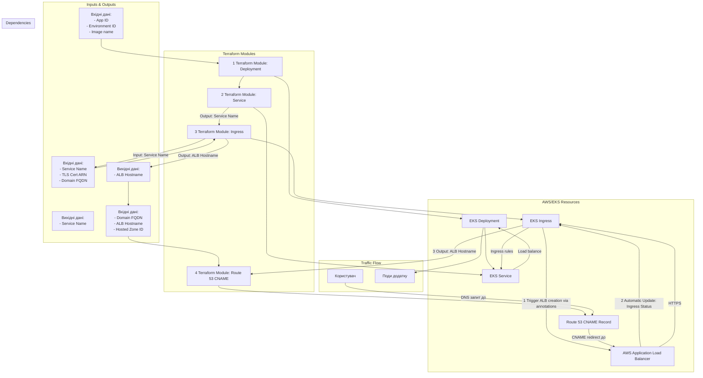

# Creation flow and inputs/outputs of Route, DNS, TLS Cert, Ingress, ALB 

Inputs
Humnaitec orchestrator
EKS cluster in Auto Mode

```mermaid
graph TD
    subgraph "Terraform Modules"
        A[1 Terraform Module: Deployment]
        B[2 Terraform Module: Service]
        C[3 Terraform Module: Ingress]
        D[4 Terraform Module: Route 53 CNAME]
    end

    subgraph "AWS/EKS Resources"
        EKS_Deployment[EKS Deployment]
        EKS_Service[EKS Service]
        EKS_Ingress[EKS Ingress]
        AWS_ALB[AWS Application Load Balancer]
        Route53_Record[Route 53 CNAME Record]
    end

    subgraph "Inputs & Outputs"
        direction LR
        I1[Вхідні дані:<br/>- App ID<br/>- Environment ID<br/>- Image name]
        O1[Вихідні дані:<br/>- Service Name]
        I2[Вхідні дані:<br/>- Service Name<br/>- TLS Cert ARN<br/>- Domain FQDN]
        O2[Вихідні дані:<br/>- ALB Hostname]
        I3[Вхідні дані:<br/>- Domain FQDN<br/>- ALB Hostname<br/>- Hosted Zone ID]
    end

    subgraph "Dependencies"
        I1 --> A --> EKS_Deployment --> EKS_Service
        A --> B --> EKS_Service
        B -- Output: Service Name --> C
        C -- Input: Service Name --> I2
        I2 --> C --> EKS_Ingress
        EKS_Ingress -- 1 Trigger ALB creation via annotations --> AWS_ALB
        AWS_ALB -- 2 Automatic Update: Ingress Status --> EKS_Ingress
        EKS_Ingress -- 3 Output: ALB Hostname --> D
        C -- Output: ALB Hostname --> O2
        O2 --> I3
        I3 --> D --> Route53_Record
    end

    subgraph "Traffic Flow"
        User[Користувач]
        User -- DNS запит до --> Route53_Record
        Route53_Record -- CNAME redirect до --> AWS_ALB
        AWS_ALB -- HTTPS --> EKS_Ingress
        EKS_Ingress -- Ingress rules --> EKS_Service
        EKS_Service -- Load balance --> EKS_Deployment
        EKS_Deployment --> AppPods[Поди додатку]
    end
```
