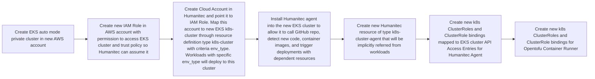
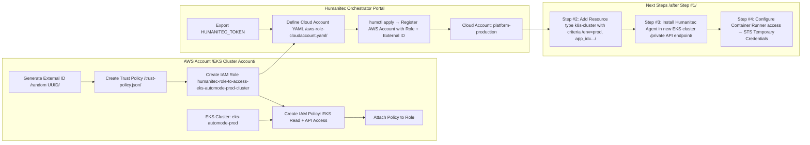

# Humanitec integrating new private EKS cluster in DirectMode with humanitec agent 
Assumptions:
EKS auto mode cluster with private endpoint
EKS access entries uses instead of aws-auth mapping to IRSA 
Humanitec agent will running inside EKS 'call home' to Humanitec for new Deployments aka GitOps flow
Humanitec Orchestrator is running 'Direct/Agent' mode

