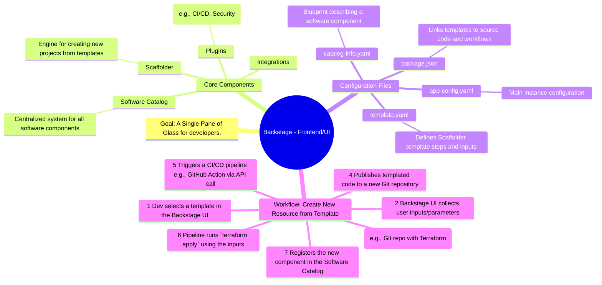

```mermaid
mindmap
  root((Backstage - Frontend/UI))
    Goal: A Single Pane of Glass for developers.
    Core Components
      Software Catalog
        Centralized system for all software components
      Scaffolder
        Engine for creating new projects from templates
      Plugins
        Extend functionality (e.g., CI/CD, Security)
      Integrations
    Configuration Files
      catalog-info.yaml
        Blueprint describing a software component
      app-config.yaml
        Main instance configuration
      template.yaml
        Defines Scaffolder template steps and inputs
      package.json
        Links templates to source code and workflows
    Workflow: Create New Resource from Template
      1 Dev selects a template in the Backstage UI
      2 Backstage UI collects user inputs/parameters
      3 Scaffolder action fetches base code (e.g., Git repo with Terraform)
      4 Publishes templated code to a new Git repository
      5 Triggers a CI/CD pipeline e.g., GitHub Action via API call
      6 Pipeline runs `terraform apply` using the inputs
      7 Registers the new component in the Software Catalog
```
