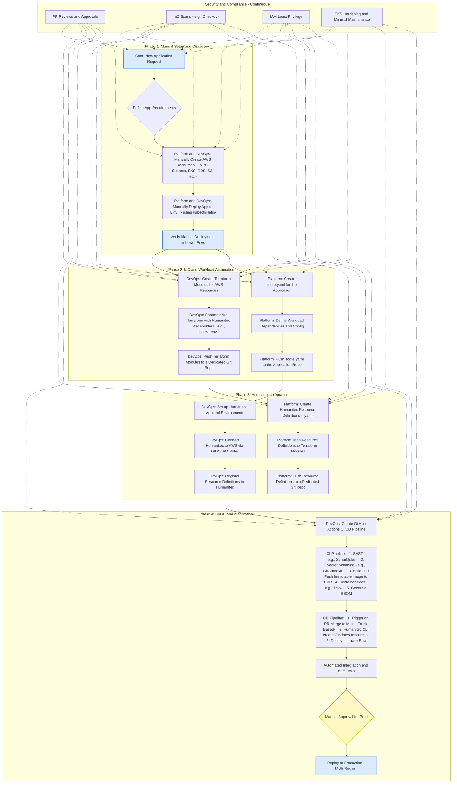
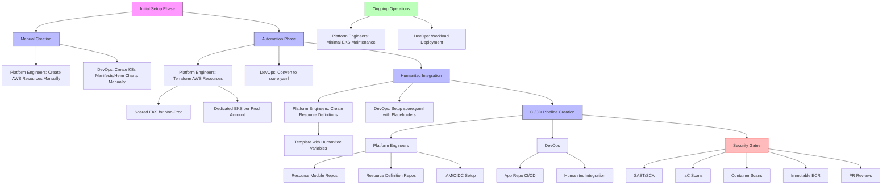

# Internal-Developers-Platforms-overview
## Backstage with Humanitec orchestrator Platform Engineers and DevOps work flow
Assumptions:  

```
Public Cloud  : AWS  

k8s cluster   : EKS Auto Mode  

CI/CD         : GitHub Actions  

IaaC          : Terraform/Opentofu

Org Structure : DevOps in Dev Teams, Platform Enginners separate team

Issue         : Who supports Platform Infra (Platform EKS clusters, AWS accounts, Volumes, SSO/Accesses, GitHub permissions, SonarQube etc)
```



Other view (anchored to Team)




