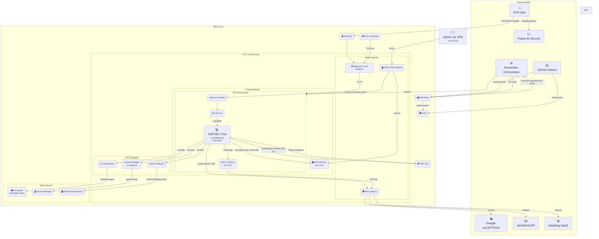

```mermaid
graph TD
    subgraph "External World"
        User[<font size=5>👤<br>End User</font>]
        SaaS_Google[<font size=5>🌐<br>Google reCAPTCHA</font>]
        SaaS_SendGrid[<font size=5>✉️<br>SendGrid API</font>]
        SaaS_DataDog[<font size=5>📊<br>DataDog SaaS</font>]
        SaaS_Humanitec[<font size=5>⚙️<br>Humanitec Orchestrator</font>]
        SaaS_PowerBI[<font size=5>📈<br>Power BI Service</font>]
        CICD_GitHub[<font size=5>📦<br>GitHub Actions</font>]
    end

    subgraph "AWS Cloud"
        Route53(fa:fa-globe Route 53)
        ACM(fa:fa-shield-alt ACM Certificate)
        ECR(fa:fa-box ECR)
        STS(fa:fa-key AWS STS)
        IAM(fa:fa-users-cog IAM Roles)

        subgraph VPC [VPC 10.105.0.0/16]
            direction LR
            subgraph PublicSubnets [Public Subnets]
                ALB(fa:fa-random Application Load Balancer)
                NAT_GW(fa:fa-server NAT Gateway)
                VPN_EP(fa:fa-lock Client VPN Endpoint)
            end

            subgraph PrivateSubnets [Private Subnets]
                subgraph EKS [EKS Auto Cluster]
                    Ingress(Ingress Controller)
                    Service(K8s Service)
                    Pod[<font size=5>💻<br>ASP.NET Pod</font><br>on Bottlerocket<br>Port 8080]
                    DD_Collector(DDOT Collector<br>Port 4317)
                end
                RDS(fa:fa-database RDS MS SQL<br>Port 1433)
            end
            
            subgraph VPCEndpoints [VPC Endpoints]
                S3_EP(S3 GW Endpoint)
                SM_EP(Secrets Manager<br>IF Endpoint)
                SSM_EP(SSM IF Endpoint)
            end
        end

        subgraph AWS_Services
            S3(fa:fa-archive S3 Bucket<br>Encrypted Logos)
            SecretsManager(fa:fa-user-secret Secrets Manager)
            SSM(fa:fa-file-alt SSM Parameter Store)
        end
    end

    %% --- USER FLOW ---
    User -- HTTPS/443 CNAME --> Route53
    Route53 --> ALB
    ACM -- TLS Cert --> ALB
    ALB -- HTTP --> Ingress
    Ingress --> Service
    Service -- Port 8080 --> Pod

    %% --- POD OUTBOUND & AWS SERVICES ---
    Pod -- Pod Identity assumes Role via --> STS
    STS -- Temp Credentials --> Pod
    Pod -- via Role --> SM_EP
    SM_EP -- reads secrets --> SecretsManager
    Pod -- via Role --> SSM_EP
    SSM_EP -- reads antiforgery token --> SSM
    Pod -- via Role --> S3_EP
    S3_EP -- read/write logos --> S3
    Pod -- Encrypted SQL Conn/1433 --> RDS

    %% --- POD OUTBOUND EXTERNAL ---
    Pod -- Outbound API Calls --> NAT_GW
    NAT_GW -- Internet --> SaaS_Google
    NAT_GW -- Internet --> SaaS_SendGrid
    User -- Embeds Reports --> SaaS_PowerBI
    
    %% --- MONITORING FLOW ---
    Pod -- OTEL data --> DD_Collector
    DD_Collector -- 4317/tcp --> NAT_GW
    NAT_GW -- Internet --> SaaS_DataDog

    %% --- MANAGEMENT & CI/CD ---
    ClientVPN_User[<font size=5>👨‍💻<br>Admin via VPN</font><br>10.0.0.0/22]
    ClientVPN_User -- mTLS --> VPN_EP
    VPN_EP -- Access to 10.105.0.0/16 --> EKS
    VPN_EP -- Access --> RDS
    
    CICD_GitHub -- Assumes Role --> IAM
    IAM -- grants access --> ECR
    CICD_GitHub -- docker push --> ECR

    SaaS_Humanitec -- API Calls --> IAM
    IAM -- Assumes Operator/User Roles --> SaaS_Humanitec
    SaaS_Humanitec -- controls --> EKS
    
EOF

```
