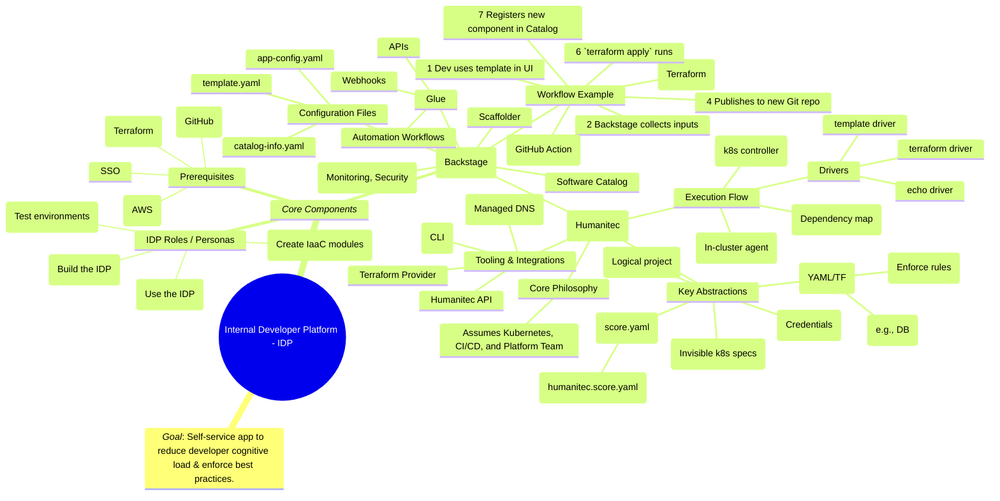

# Internal Dveloper platform with Software Catalog (Backstage) and Orchestrator (Humanitec)

```mermaid
mindmap
  root((Internal Developer Platform - IDP))
    _Goal_: Self-service app to reduce developer cognitive load & enforce best practices.
    _Core Components_
      _Frontend/UI_ (Backstage)
        Software Catalog
        Scaffolder
        Plugins (Monitoring, Security)
        Configuration Files
          catalog-info.yaml
          app-config.yaml
          template.yaml
        Workflow Example
          1 Dev uses template in UI
          2 Backstage collects inputs
          3 Scaffolder fetches base code (Terraform)
          4 Publishes to new Git repo
          5 Triggers CI/CD (GitHub Action)
          6 `terraform apply` runs
          7 Registers new component in Catalog
       Backend/Orchestrator (Humanitec)  
        Core Philosophy
          Assumes Kubernetes, CI/CD, and Platform Team
        Key Abstractions
          Application (Logical project)
          Cloud Account (Credentials)
          Workload Definition (score.yaml)
            Score Extension (humanitec.score.yaml)
          Resource Definitions (YAML/TF)
            Type: Resource (e.g., DB)
            Type: Config (Enforce rules)
          Workload Profiles (Invisible k8s specs)
        Execution Flow
          Resource Graph (Dependency map)
          Humanitec Operator (k8s controller)
          Humanitec Agent (In-cluster agent)
          Drivers
            terraform driver
            template driver
            echo driver
        Tooling & Integrations
          humctl (CLI)
          Humanitec API
          Terraform Provider
          Newapp.io (Managed DNS)
       Glue  
        APIs
        Webhooks
        Automation Workflows
     Prerequisites  
      Centralized Git Repo & CI/CD (GitHub)
      Cloud Infrastructure (AWS)
      IaaC Tool (Terraform)
      SSO
     IDP Roles / Personas  
      Platform Engineers/Devs (Build the IDP)
      Platform/Infra DevOps (Create IaaC modules)
      Developers/Team Leads (Use the IDP)
      QAs / Pen-testers (Test environments)
```
