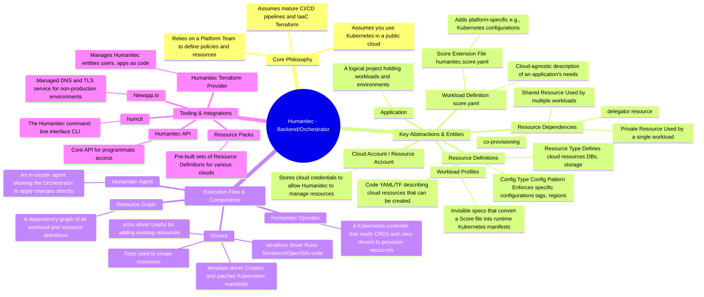

```mermaid
mindmap
  root((Humanitec - Backend/Orchestrator))
    Core Philosophy
      Assumes you use Kubernetes in a public cloud
      Assumes mature CI/CD pipelines and IaaC Terraform
      Relies on a Platform Team to define policies and resources
    Key Abstractions & Entities
      Application
        A logical project holding workloads and environments
      Cloud Account / Resource Account
        Stores cloud credentials to allow Humanitec to manage resources
      Workload Definition score.yaml
        Cloud-agnostic description of an application's needs
        Score Extension File humanitec.score.yaml
          Adds platform-specific e.g., Kubernetes configurations
      Resource Definitions
        Code YAML/TF describing cloud resources that can be created
        Resource Type Defines cloud resources DBs, storage
        Config Type Config Pattern Enforces specific configurations tags, regions
      Resource Dependencies
        Private Resource Used by a single workload
        Shared Resource Used by multiple workloads
        delegator resource
        co-provisioning 
      Workload Profiles
        Invisible specs that convert a Score file into runtime Kubernetes manifests
    Execution Flow & Components
      Resource Graph
        A dependency graph of all workload and resource definitions
      Humanitec Operator
        A Kubernetes controller that reads CRDs and uses drivers to provision resources
      Humanitec Agent
        An in-cluster agent allowing the Orchestrator to apply changes directly
      Drivers
        Tools used to create resources
        terraform driver Runs Terraform/OpenTofu code
        template driver Creates and patches Kubernetes manifests
        echo driver Useful for adding existing resources
    Tooling & Integrations
      humctl
        The Humanitec command-line interface CLI
      Humanitec API
        Core API for programmatic access
      Humanitec Terraform Provider
        Manages Humanitec entities users, apps as code
      Resource Packs
        Pre-built sets of Resource Definitions for various clouds
      Newapp.io
        Managed DNS and TLS service for non-production environments
```
